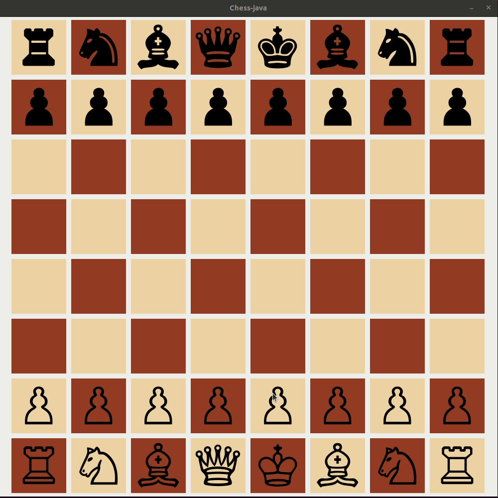

# Chess-java

This is a java application powered by Swing that implements the game of chess.

## Features

- Shows legal moves of a given piece
- Allows capturing en passant
- Handles checkmate 

## Demo

## Authors

[dixrow](https://github.com/dixrow)
[singiamtel](https://github.com/singiamtel)